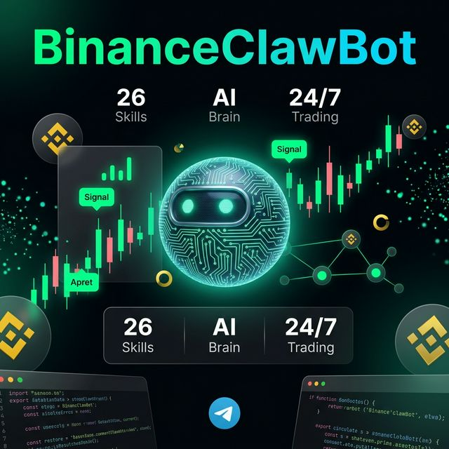

<div align="center">



# 🤖 BinanceClawBot

**The World's Most Advanced Autonomous Crypto Trading Platform**

[](https://python.org)
[](https://nextjs.org)
[](https://binance.com)
[](LICENSE)
[](Dockerfile)

*26 Binance Skills · OpenAI + Gemini OAuth · 3D Web Dashboard · 24/7 Telegram AI Brain*

[🚀 Quick Start](#-quick-start) · [📋 Commands](#-commands) · [🌐 Web Dashboard](#-web-dashboard) · [🔧 Skills](#-binance-skills-26)

</div>

---

## ✨ Features

| Feature | Details |
|--------|---------|
| 🔧 **26 Binance Skills** | All skills from the official Binance Skills Hub — algo, spot, futures, margin, earn, defi, web3 |
| 🤖 **AI Brain** | OpenAI + Gemini + Antigravity OAuth — no API keys stored, PKCE authentication |
| 📱 **Telegram Bot** | 27 commands, inline keyboards, real-time alerts, 24/7 autonomous trading |
| 🌐 **Web Dashboard** | 3D animated Next.js app, OAuth login, floating AI assistant on every page |
| ⚡ **30s Automation** | Scan → Signal → Risk → Execute loop every 30 seconds on 10 pairs |
| 🛡️ **Risk Engine** | 5% max position, 10% daily loss circuit breaker, 5x max leverage |
| 🐳 **Docker Ready** | One command Ubuntu 24/7 deployment |

---

## 🚀 Quick Start

### Prerequisites
```bash
python 3.12+   node 20+   docker (optional)   git
```

### 1. Clone & Install
```bash
git clone https://github.com/Maliot100X/BinanceClawBot.git
cd BinanceClawBot

# Also clone the Binance Skills Hub
git clone --depth=1 https://github.com/binance/binance-skills-hub.git

# Install Python dependencies
pip install -r requirements.txt

# Install web dashboard dependencies
cd dashboard && npm install && cd ..
```

### 2. Configure
```bash
cp .env.example .env
nano .env          # Fill in your credentials
```

Required credentials in `.env`:
```env
BINANCE_API_KEY=your_key
BINANCE_SECRET_KEY=your_secret
TELEGRAM_BOT_TOKEN=your_bot_token
TELEGRAM_CHAT_ID=your_chat_id

# OAuth (no plain API keys — browser login)
OPENAI_OAUTH_CLIENT_ID=your_openai_client_id
OPENAI_OAUTH_CLIENT_SECRET=your_openai_client_secret
OPENAI_REDIRECT_URI=http://localhost:8080/callback

GEMINI_OAUTH_CLIENT_ID=your_google_client_id
GEMINI_OAUTH_CLIENT_SECRET=your_google_client_secret
```

### 3. Authenticate AI
```bash
python -c "from ai.oauth import oauth; oauth.authenticate('openai')"
```

### 4. Run

**Option A — Full stack (recommended):**
```bash
# Terminal 1 — Python bot + API server
python api_server.py

# Terminal 2 — Telegram bot
python main.py

# Terminal 3 — Web dashboard
cd dashboard && npm run dev
```

**Option B — Docker (24/7):**
```bash
docker compose up -d
docker compose logs -f
```

**Option C — Ubuntu one-command deploy:**
```bash
bash deploy.sh
```

---

## 📋 Commands

### Telegram Bot Commands

| Command | Description |
|---------|-------------|
| `/start` | Launch the bot & show main menu |
| `/help` | Show all 27 commands |
| `/menu` | Interactive inline keyboard menu |
| `/status` | System status + OAuth connection |
| `/startbot` | ▶️ Enable autonomous trading (30s loop) |
| `/stopbot` | ⏹ Pause all trading |
| `/scan` | 🔍 Scan 10 markets for signals now |
| `/portfolio` | 💼 Full portfolio + balances |
| `/positions` | 📋 Open positions with PnL |
| `/profit` | 📈 Daily/weekly PnL report |
| `/buy BTCUSDT 0.001` | 🟢 Market buy |
| `/sell BTCUSDT 0.001` | 🔴 Market sell |
| `/limit BTCUSDT BUY 0.001 60000` | Limit order |
| `/futures BTCUSDT BUY 0.01` | Futures order |
| `/close BTCUSDT` | Close specific position |
| `/closeall` | Close ALL open positions |
| `/leverage BTCUSDT 5` | Set leverage |
| `/funding BTCUSDT` | Funding rate |
| `/ticker BTCUSDT` | Live price ticker |
| `/signals` | AI trading signals with confidence |
| `/earn` | Simple earn products |
| `/convert BTC USDT 0.1` | Instant convert |
| `/history` | Trade history |
| `/risk` | Risk management status |
| `/analyze BTCUSDT` | AI deep technical analysis |
| `/ai` | Chat directly with AI brain |
| `/auth` | OAuth authentication (OpenAI/Gemini/Antigravity) |

### CMD / Terminal Commands

```bash
# Start everything
python main.py                    # Telegram bot + 30s scheduler
python api_server.py              # Web API server (port 8000)

# OAuth authentication
python -c "from ai.oauth import oauth; oauth.authenticate('openai')"
python -c "from ai.oauth import oauth; oauth.authenticate('gemini')"
python -c "from ai.oauth import oauth; print(oauth.status())"

# Test Binance connection
python -c "
import asyncio
from core.client import get_client
async def test():
    c = get_client()
    r = await c.get_account()
    print('✅ Connected:', r.get('accountType'))
asyncio.run(test())
"

# Test all 26 skills
python -c "
from skills.loader import SKILLS
print('Skills loaded:', len(SKILLS))
for name in SKILLS: print(f'  ✓ {name}')
"

# Run market scan
python -c "
import asyncio
from core.scheduler import run_cycle
asyncio.run(run_cycle())
"

# Docker commands
docker compose up -d              # Start 24/7
docker compose logs -f            # View logs
docker compose down               # Stop
docker compose restart            # Restart
```

---

## 🌐 Web Dashboard

```bash
cd dashboard
npm install
npm run dev                       # http://localhost:3000
```

**Pages:**
| Page | URL | Description |
|------|-----|-------------|
| Login | `/login` | OAuth login (Google/GitHub) |
| Dashboard | `/dashboard` | Live stats, chart, signals, bot controls |
| Portfolio | `/portfolio` | Asset allocation pie chart + balances |
| Signals | `/signals` | Live trading signals with confidence bars |
| Positions | `/positions` | Open positions with close button |
| Skills | `/skills` | All 26 Binance skills overview |
| Settings | `/settings` | OAuth, Telegram, Binance, Risk config |

**Deploy to Vercel:**
```bash
cd dashboard
npx vercel --prod
```

Set environment variables in Vercel dashboard:
- `NEXTAUTH_SECRET`, `NEXTAUTH_URL`
- `GOOGLE_CLIENT_ID`, `GOOGLE_CLIENT_SECRET`
- `GITHUB_CLIENT_ID`, `GITHUB_CLIENT_SECRET`
- `NEXT_PUBLIC_API_URL` → your backend URL

---

## 🔧 Binance Skills (26)

All loaded from [binance/binance-skills-hub](https://github.com/binance/binance-skills-hub):

<details>
<summary>Click to expand all 26 skills</summary>

| Skill | Type | Key Endpoints |
|-------|------|--------------|
| `algo` | Binance | TWAP, VP futures/spot orders |
| `alpha` | Binance | Alpha token ticker, klines, trades |
| `assets` | Binance | Balances, withdraw, deposit, dust |
| `convert` | Binance | Instant crypto conversion |
| `derivatives-coin-futures` | Binance | COIN-M futures (DAPI) |
| `derivatives-options` | Binance | European options (EAPI) |
| `derivatives-portfolio-margin` | Binance | Portfolio margin account |
| `derivatives-portfolio-margin-pro` | Binance | Portfolio margin PRO |
| `derivatives-usds-futures` | Binance | USDS-M futures (FAPI) |
| `fiat` | Binance | Fiat deposits/withdrawals |
| `margin-trading` | Binance | Cross & isolated margin |
| `onchain-pay` | Binance | Binance Pay merchant API |
| `p2p` | Binance | P2P trade history |
| `simple-earn` | Binance | Flexible & locked earn |
| `spot` | Binance | Full spot market (all orders) |
| `square-post` | Binance | Binance Square social |
| `sub-account` | Binance | Sub-account management |
| `vip-loan` | Binance | VIP crypto loans |
| `binance-tokenized-securities` | Web3 | Tokenized real-world assets |
| `crypto-market-rank` | Web3 | Market cap ranking, trending |
| `meme-rush` | Web3 | Meme token leaderboard |
| `query-address-info` | Web3 | On-chain address lookup |
| `query-token-audit` | Web3 | Smart contract security audit |
| `query-token-info` | Web3 | DexScreener token pairs |
| `trading-signal` | Web3 | AI trading signals |

</details>

---

## 🏗️ Architecture

```
BinanceClawBot/
├── main.py              # Telegram bot entrypoint (24/7)
├── api_server.py        # FastAPI backend (port 8000)
├── skills/loader.py     # All 26 Binance skills imported
├── ai/
│   ├── oauth.py         # OpenAI + Gemini + Antigravity OAuth (PKCE)
│   └── codex_agent.py   # AI trading brain with tool-use loop
├── core/
│   ├── client.py        # Binance REST + WebSocket client
│   └── scheduler.py     # 30-second automation loop
├── signals/
│   ├── indicators.py    # RSI, MACD, EMA, VWAP, Volume
│   └── signal_generator.py  # Multi-strategy signal aggregator
├── execution/order_engine.py  # Spot/Futures orders + SL/TP
├── risk/risk_manager.py       # Position sizing + circuit breaker
├── telegram/bot.py            # 27-command Telegram interface
├── dashboard/                 # Next.js 14 web app (Vercel)
│   ├── app/
│   │   ├── (protected)/       # Auth-guarded pages
│   │   │   ├── dashboard/     # 📊 Live stats + chart
│   │   │   ├── portfolio/     # 💼 Asset balances
│   │   │   ├── signals/       # 📡 Trading signals
│   │   │   ├── positions/     # 📋 Open positions
│   │   │   ├── skills/        # 🔧 26 skills overview
│   │   │   └── settings/      # ⚙️ Configure everything
│   │   └── login/             # OAuth login page
│   └── components/
│       ├── FloatingBot.tsx    # AI assistant on every page
│       └── Sidebar.tsx        # Navigation with live status
├── binance-skills-hub/        # Cloned from Binance GitHub
├── Dockerfile
├── docker-compose.yml
└── deploy.sh                  # Ubuntu one-command deploy
```

---

## 🛡️ Risk Management

| Rule | Value |
|------|-------|
| Max position size | **5%** of portfolio |
| Daily loss circuit breaker | **10%** — bot stops automatically |
| Max leverage | **5x** |
| Stop loss | **Required** on every trade |
| Dry run mode | **Default ON** — no real orders until disabled |

---

## 🔐 Security

- ✅ **No API keys in code** — all credentials via `.env`
- ✅ **OAuth PKCE** — no OpenAI plain API key ever stored
- ✅ **Token encryption** — OAuth tokens stored with file permissions 600
- ✅ **Auto-refresh** — tokens refreshed transparently
- ✅ **Confirmation required** — mainnet trades require "CONFIRM" in Telegram
- ✅ **Circuit breaker** — auto-stops bot on max daily loss

---

## 📄 License

```
MIT License — Copyright (c) 2025 Maliot100X / BinanceClawBot

Permission is hereby granted, free of charge, to any person obtaining a copy
of this software and associated documentation files (the "Software"), to deal
in the Software without restriction, including without limitation the rights
to use, copy, modify, merge, publish, distribute, sublicense, and/or sell
copies of the Software, and to permit persons to whom the Software is
furnished to do so, subject to the following conditions:

The above copyright notice and this permission notice shall be included in all
copies or substantial portions of the Software.

THE SOFTWARE IS PROVIDED "AS IS", WITHOUT WARRANTY OF ANY KIND. USE AT YOUR OWN RISK.
CRYPTO TRADING INVOLVES SUBSTANTIAL RISK OF LOSS.
```

---

<div align="center">

**Built with ❤️ by [Maliot100X](https://github.com/Maliot100X)**

🤖 · 26 Skills · OpenAI OAuth · Gemini · Antigravity · Telegram · 24/7

</div>
